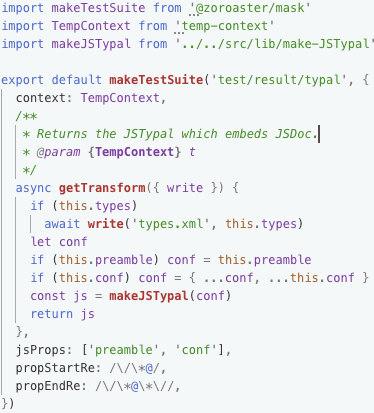
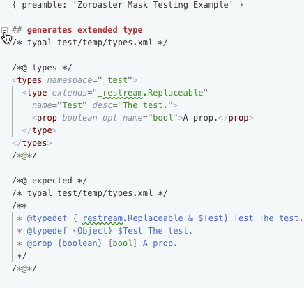

# Zoroaster

[](https://www.npmjs.com/package/zoroaster)

[](https://travis-ci.org/contexttesting/zoroaster)
[](https://ci.appveyor.com/project/zavr-1/zoroaster/branch/master)

[](https://contexttesting.com) _Zoroaster_ is a modern JavaScript testing framework for _Node.js_. It introduces the concept of test contexts, which aim in helping to provide documentable and re-usable test infrastructure, across spec files in a single package, as well as across packages. It's a completely new and developer-friendly approach to writing tests, which greatly improves productivity, testing experience and the reliability on tests. In addition, it allows to write _ES6_ module syntax without `Babel`.

For example, you can make use of `https-context` to set-up a mock HTTP server with configurable responses and `temp-context` to create and remove a temp directory ready for each test without having to worry about repetitively writing the same code across projects. The way tests are written allows to see IDE suggestions for every method and property available in a context. Because these packages are maintained as separate pieces of software, they are also tested which means that there are less chances of an error in test set-ups which could lead to false-positive results.

[](http://www.crystalinks.com/zoroaster.html)[](http://nodejs.tools) Are you fed up with `mocha` or have you had enough `chai` in your life? Is it not time to say good-bye to the old stereotype that the same software must be used every day? Say no more, _Zoroaster_ is here to save our souls and bring a change.

---

```fs
yarn add -D zoroaster
```

```fs
npm i --save-dev zoroaster
```

<p align="center"><a href="#table-of-contents">
  
</a></p>

## Table Of Contents

- [Table Of Contents](#table-of-contents)
- [Do You Want Testing Framework That...](#do-you-want-testing-framework-that)
  * [Is Very Small And Super Fast](#is-very-small-and-super-fast)
  * [Shares Set-Ups And Tear-Downs Between Files And Packages](#shares-set-ups-and-tear-downs-between-files-and-packages)
  * [Implements Masks To Only Write Inputs/Outputs](#implements-masks-to-only-write-inputsoutputs)
  * [Was Made To Test Forks](#was-made-to-test-forks)
  * [Supports Snapshots And Streams](#supports-snapshots-and-streams)
- [Quick Example](#quick-example)
- [Example](#example)
  * [async functions](#async-functions)
  * [Running Example](#running-example)
- [Wiki](#wiki)
- [Copyright & License](#copyright--license)

<p align="center"><a href="#table-of-contents">
  
</a></p>

## Do You Want Testing Framework That...

_Zoroaster_ is the most modern _Node.JS_ testing framework that addresses the full spectrum of developer's needs and innovates the way quality assurance is done on NPM packages.

### Is Very Small And Super Fast

_Zoroaster_ does not have many dependencies and does not install Babel, yet it is able to run tests with `import/export` statements. Having less dependencies in `node_modules` means that any new dependencies needed for the project will be installed immediately without having to wait for linking to complete, and new projects can be started in seconds, resolving all testing framework's dependencies almost instantly. Furthermore, _Zoroaster_ only loads 3 JavaScript files, that is itself (1000 lines of code optimised with _Google Closure Compiler_), the interface for a service context (34 lines) and the _RegExp-based_ algorithm to transpile `import/export` statements (when the `-a` option is passed) which is also optimised. The tests will start and run in milliseconds.

| Framework | Fetching | Linking |  Disk   | Node_Module Dirs | yarn.lock Lines | Downloads |
| --------- | -------- | ------- | ------- | ---------------- | --------------- | --------- |
| Jest      | 485      | 7407    | 59.75MB | 420              | 3614            | 3,713,921 |
| Mocha     | 115      | 2016    | 12.17MB | 103              | 785             | 2,523,262 |
| Jasmine   | 13       | 106     | 896KB   | 13               | 88              | 1,040,918 |
| Tape      | 33       | 506     | 2.85MB  | 33               | 228             | 411,483   |
| Ava       | 462      | 6605    | 34.34MB | 378              | 3281            | 122,355   |
| Tap       | 469      | 7905    | 94.12MB | 407              | 3375            | 101,879   |
| Zoroaster | 4        | 31      | 448KB   | 3                | 27              | 1096      |

Compared to the other frameworks, _Jasmine_ test runner is the next most-lightweight one, followed by modest _Tape_ and good old _Mocha_, however they don't support snapshots and don't work with ES6 modules out of the box. Although there is no browser version of `zoroaster` at the moment, it is still possible to test the source code in the browser, for example by setting up a server that loads HTML pages with JS code, and using the headless Chrome to open those pages and get the result. There will be more support for browsers in the near future.

<p align="center"><a href="#table-of-contents">
  
</a></p>

### Shares Set-Ups And Tear-Downs Between Files And Packages

One of the disadvantages of conventional testing frameworks is that they force developers to put setup and tear-down logic directly in test suites, which prevents management of tests by files. Using local scopes to store test states, limited access to the JSDoc and breaking of the DRY (don't repeat yourself) principle makes testing inconvenient. _Zoroaster_ is the first **Context-Testing** framework that approaches the problem from the completely different angle: there is no setups and teardowns on tests, there is a context, which can be initialised and destroyed. Contexts are kept in separate files and can be written as classes, which greatly improves developer experience by allowing to access contexts' documented APIs. The contexts can be tested on their own merit, i.e. there is an inherent possibility to "test the tests" to take the quality assurance to the next level. Unlike before and after eachs, test contexts can not only be shared by test suites in different files, but also be published and reused across projects, so that more time is left to actually writing the tests and rather than wasting it on repetitive setups.

<p align="center">
  
</p>

<a href="../../wiki/contexts"><kbd>🏭 Read Context Testing Wiki ></kbd></a>

<p align="center"><a href="#table-of-contents">
  
</a></p>

### Implements Masks To Only Write Inputs/Outputs

A test is a function which passes inputs to a method and compares the output to the expected one. A single method can receive 100s different inputs, including edge cases. Normally, each input would be added as a new test, where the same logic is repeated to run the method. _Zoroaster_ eliminates the need to repeat the same code over and over again, and allows to focus on only adding new inputs to the existing test base to cover larger search field of the method under test. The routine to create tests, or test constructor is called a mask and is written in JavaScript, whereas the test input/outputs and any additional parameters can be written in plain text, such as `markdown` or any other language that is the most convenient for syntax highlighting. Mask testing in _Zoroaster_ is highly configurable, and combined with contexts provides the quickest, easiest and most flexible way to complete test coverage. Testing streams is also possible with masks &mdash; it is only required to write the `getTransform` or `getReadable` methods, and the output will be automatically collected and compared against the expected mask result.


<table>
<tr><th>Mask</th><th>Mask Result</th></tr>
<tr><td>
</td><td>
</td></tr>
<tr><td>The mask uses the <code>makeTestSuite</code> method to create a test suite with multiple tests which perform the same logic, but for different inputs. Here, we use the <code>getTransform</code> property to create a stream which will find a certain marker in the code which points to the location of types.xml file, and read that file to embed JSDoc documentation. We also make use of the TempContext which writes the <code>types</code> property of the mask into a temp file.</td>
<td>After the mask is setup once, we can add as many tests as we want in the mask result file easily. Because the <code>getTransform</code> property was specified, the transform stream returned by it will be ended with the result's input, and the output collected and compared against the <code>expected</code> property of the mask. We use a custom <code>propStart</code> and <code>propEnd</code> regular expressions that split properties by <code>/*@</code> (start) and <code>/*@*/</code> (end), because the default is <code>/*</code> (start) and <code>/**/</code> (end) which would interfere with generated JSDoc.</td>
</tr>
</table>

<a href="../../wiki/masks"><kbd>🎭 Read Mask Testing Wiki ></kbd></a>

<p align="center"><a href="#table-of-contents">
  
</a></p>

### Was Made To Test Forks

Creating CLI Node.JS applications is fun. Testing them is not so much, because there is always the need to create new child processes, manage their state, interact with them somehow and then assert on inputs and outputs. In addition to simple mask testing, _Zoroaster_ has a special configuration object that can be passed to the mask called `fork`, where it is possible to specify what module to fork, what options to pass to it and even what inputs should be entered into its `stdin` when a value matching a `RegExp` comes up. The arguments are taken from the mask result ("the plain file") input, and compared to `stdout` and `stderr` properties of the result. Now all the developers have to do is write their arguments, configure options, possibly use test context (such as `temp-context` to create and delete temp directories and get their snapshots by the end of the test) and supply the expected output of the CLI program.

<a href="../../wiki/forks"><kbd>🍴 Read Forks Wiki ></kbd></a>

<p align="center"><a href="#table-of-contents">
  
</a></p>

### Supports Snapshots And Streams

Although some people don't approve of snapshot testing, it is an extremely useful tool for regression testing. There is no difference between writing asserts within specs, specifying them in masks, or returning them in snapshots, except that in the first case it takes a lot of manual labour, in the second case they are more visible, and in the third case they only require a second to write, but provide the robust mechanism against unexpected changes in the future, and thus are a good regression testing strategy. There is no additional methods to be called to create a snapshot, tests only need to return a value. Moreover, snapshots' file extension can be specified so that they can be naturally inspected with syntax highlighting in the IDE (e.g., for markdown files), and custom serialisation algorithms can be implemented. If a test returns a stream, its data will also be collected prior to being tested against a snapshot.

<a href="../../wiki/snapshots"><kbd>📸 Read Snapshots Wiki ></kbd></a>

---

These are the main features of _Zoroaster_ &mdash; the testing framework made by professional _Node.JS_ developers made for other professional _Node.JS_ developers and quality assurance experts. Unfortunately, there is no coverage tool at the moment, but we hope to add one in the near future. Nonetheless, the test contexts, mask and fork testing and its small size and performance will make it the testing framework of choice for developers who are tired of old paradigms.

<p align="center"><a href="#table-of-contents">
  
</a></p>

## Quick Example

All _Zoroaster_ tests are written in spec files and exported as tests suites which are objects.

For example, tests can be run against sync and async methods.

```js
// example program source code
export const software = (type) => {
  switch (type) {
  case 'boolean':
    return true
  case 'string':
    return 'string'
  default:
    return null
  }
}

export const asyncSoftware = async (type) => {
  await new Promise(r => setTimeout(r, 50))
  return software(type)
}
```

The _Context_ can be used as an alternative for in-test suite set-up and tear-down routines. Anything returned by tests will be compared against snapshots that will be created upon the first run of the test.

```js
// Zoroaster test suite
import { ok, equal } from 'assert'
import { software, asyncSoftware } from './src'

class Context {
  async _init() {
    await new Promise(r => setTimeout(r, 100))
    this._data = 'hello world;'
  }
  /** Returns the testing data */
  get data() {
    return this._data
  }
}

/**
 * @type {Object.<string, (c:Context)>}
 */
const TestSuite = {
  context: Context,
  'runs a test'() {
    const res = software('boolean')
    ok(res)
  },
  async 'runs an async test'() {
    const res = await asyncSoftware('string')
    equal(res, 'string')
  },
  async 'supports snapshots'({ data }) {
    const res = await asyncSoftware('string')
    return `${res} :: ${data}`
  },
}

export default TestSuite
```


<p align="center"><a href="#table-of-contents">
  
</a></p>

## Example

See how to write tests with _Zoroaster_ in this section.

First, create a module which exports a TEST SUITE as an object in the `test/spec` directory. Second, add TESTS as functions -- properties of the test suite. Implement the tests with basic assertion methods required from `zoroaster/assert`, or use any other assertion library.

There are NO global functions and tests are just methods of test suites, which can be written using shorthand notation.

```js
/* yarn example/Zoroaster */
import { ok, equal } from 'zoroaster/assert'
import Zoroaster from '../../src'

export default {
  // standard test function
  'has static variables'() {
    ok(Zoroaster.AHURA_MAZDA)
    ok(Zoroaster.ANGRA_MAINYU)
  },

  // recursive test suites
  constructor: {
    'creates a new Zoroaster instance with default name'() {
      const zoroaster = new Zoroaster()
      ok(zoroaster instanceof Zoroaster)
      equal(zoroaster.name, 'Zarathustra')
    },
    'creates a new Zoroaster instance with a name'() {
      const name = 'Ashu Zarathushtra'
      const zoroaster = new Zoroaster(name)
      equal(zoroaster.name, name)

      const name2 = 'Zarathushtra Spitama'
      const zoroaster2 = new Zoroaster(name2)
      equal(zoroaster2.name, name2)
    },
    'has a balance of 0 when initialised'() {
      const zoroaster = new Zoroaster()
      equal(zoroaster.balance, 0)
    },
  },
}

export const checkParadise = {
  'returns false when balance is less than 1000'() {
    const zoroaster = new Zoroaster()
    const actual = zoroaster.checkParadise()
    ok(!actual)
  },
}
```

### async functions

Async functions are perfect to test with [`zoroaster testing framework`][2] due to the concise async shorthand method notation.

```js
{
  async 'returns true when balance of 1000 met'() {
    const zoroaster = new Zoroaster()
    zoroaster.createWorld()
    await Promise.all(
      Array.from({ length: 900 }).map(async () => {
        await zoroaster.side(Zoroaster.AHURA_MAZDA)
      })
    )
    equal(zoroaster.balance, 1000)
    const actual = zoroaster.checkParadise()
    ok(actual)
  },
}
```

All tests have to complete within the specified [timeout](#timeout).

### Running Example

To run the example test file, execute

```sh
yarn example/Zoroaster/
```

```fs
yarn run v1.5.1
$ node src/bin example/Zoroaster/test/spec --alamode
 example/Zoroaster/test/spec
   async-context
    ✓  returns correct country of origin
   index
    ✓  has static variables
    ✓  decreases and increase balance asynchronously
     constructor
      ✓  creates a new Zoroaster instance with default name
      ✓  creates a new Zoroaster instance with a name
      ✓  has a balance of 0 when initialised
   methods
    ✓  creates a world
    ✓  destroys a world
    ✓  says a sentence
     side
      ✓  increases balance when doing good deed
      ✓  decreases balance when doing bad deed
      ✓  throws an error when choosing an unknown side
     checkParadise
      ✓  returns true when balance of 1000 met
      ✓  returns false when balance is less than 1000
   object-context
    ✓  sets correct default name
     innerMeta
      ✓  accesses parent context
      ✓  returns correct date of birth

🦅  Executed 17 tests.
✨  Done in 0.92s.
```

<p align="center"><a href="#table-of-contents">
  
</a></p>

## Wiki

- [CLI Usage](../../wiki/CLI)
- [Assertions](../../wiki/Assert)
- [Contexts](../../wiki/Contexts)
- [Snapshots](../../wiki/Snapshots)


<p align="center"><a href="#table-of-contents">
  
</a></p>

## Copyright & License

GNU Affero General Public License v3.0


  (c) [Context Testing](https://contexttesting.com) 2020


[1]: https://artd.eco
[2]: #assertion-library
[3]: https://zoroaster.co.uk
[4]: https://zoroaster.co.uk/playground

<p align="right"></p>

<p align="center"><a href="#table-of-contents">
  
</a></p>