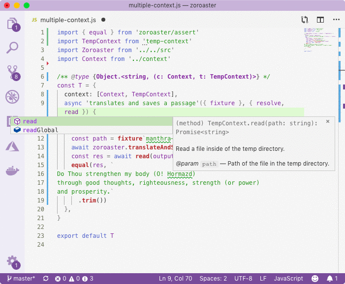
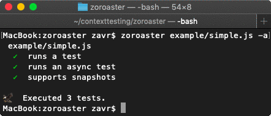
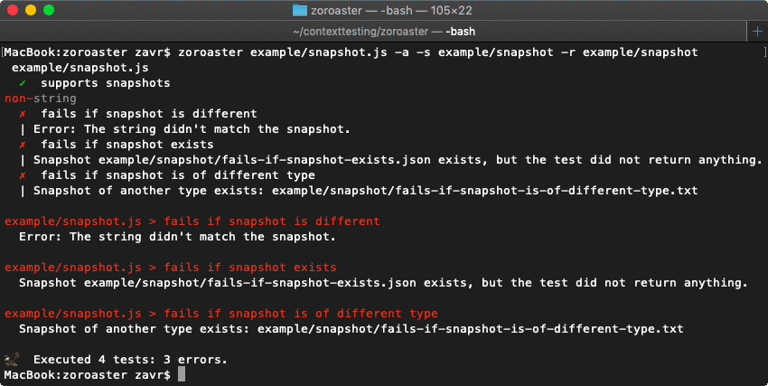

# Zoroaster

[](https://npmjs.org/package/zoroaster)

[](https://travis-ci.org/contexttesting/zoroaster)
[](https://ci.appveyor.com/project/zavr-1/zoroaster/branch/master)

[](https://contexttesting.com) _Zoroaster_ is a modern JavaScript testing framework for _Node.js_. It introduces the concept of test contexts, which aim in helping to provide documentable and re-usable test infrastructure, across spec files in a single package, as well as across packages. It's a completely new and developer-friendly approach to writing tests, which greatly improves productivity, testing experience and the reliability on tests. In addition, it allows to write _ES6_ module syntax without `Babel`.

For example, you can make use of `https-context` to set-up a mock HTTP server with configurable responses and `temp-context` to create and remove a temp directory ready for each test without having to worry about repetitively writing the same code across projects. The way tests are written allows to see IDE suggestions for every method and property available in a context. Because these packages are maintained as separate pieces of software, they are also tested which means that there are less chances of an error in test set-ups which could lead to false-positive results.

[](http://www.crystalinks.com/zoroaster.html)[](http://nodejs.tools) Are you fed up with `mocha` or have you had enough `chai` in your life? Is it not time to say good-bye to the old stereotype that the same software must be used every day? Say no more, _Zoroaster_ is here to save our souls and bring a change.

---

```fs
yarn add -DE zoroaster
```

```fs
npm i --save-dev zoroaster
```

<p align="center">
  
</p>

<p align="center"><a href="#table-of-contents"></a></p>

## Table Of Contents

- [Table Of Contents](#table-of-contents)
- [Quick Example](#quick-example)
- [Why Use Zoroaster](#why-use-zoroaster)
  * [Each Directory is a Test Suite](#each-directory-is-a-test-suite)
  * [Context as Alternative Solution](#context-as-alternative-solution)
- [Example](#example)
  * [async functions](#async-functions)
  * [Running Example](#running-example)
- [CLI](#cli)
  * [`--watch`, `-w`: Watch Files for Changes](#--watch--w-watch-files-for-changes)
  * [`--timeout`, `-t`: Timeout](#--timeout--t-timeout)
  * [`--alamode`, `-a`: `require('alamode)()`](#--alamode--a-requirealamode)
    * [`.alamoderc.json`](#alamodercjson)
  * [`--babel`, `-b`: `require(@babel/register)`](#--babel--b-requirebabelregister)
  * [`--snapshot`, `-s`](#--snapshot--s)
  * [`--snapshotRoot`, `-r`](#--snapshotroot--r)
  * [package.json](#packagejson)
- [Snapshots](#snapshots)
  * [Serialisation](#serialisation)
  * [Service Context](#service-context)
    * [Snapshot Extension](#snapshot-extension)
    * [Snapshot Source](#snapshot-source)
- [Context](#context)
  * [Object Context](#object-context)
  * [Class Context](#class-context)
  * [Multiple Contexts](#multiple-contexts)
  * [Persistent Context](#persistent-context)
- [Assertion Library](#assertion-library)
  * [throws](#throws)
- [launch.json](#launchjson)
- [Copyright](#copyright)

<p align="center"><a href="#table-of-contents"></a></p>

## Quick Example

All _Zoroaster_ tests are written in spec files and exported as tests suites which are objects.

For example, tests can be run against sync and async methods.

```js
// example program source code
export const software = (type) => {
  switch (type) {
  case 'boolean':
    return true
  case 'string':
    return 'string'
  default:
    return null
  }
}

export const asyncSoftware = async (type) => {
  await new Promise(r => setTimeout(r, 50))
  return software(type)
}
```

The _Context_ can be used as an alternative for in-test suite set-up and tear-down routines. Anything returned by tests will be compared against snapshots that will be created upon the first run of the test.

```js
// Zoroaster test suite
import { ok, equal } from 'assert'
import { software, asyncSoftware } from './src'

class Context {
  async _init() {
    await new Promise(r => setTimeout(r, 100))
    this._data = 'hello world;'
  }
  /** Returns the testing data */
  get data() {
    return this._data
  }
}

/**
 * @type {Object.<string, (c:Context)>}
 */
const TestSuite = {
  context: Context,
  'runs a test'() {
    const res = software('boolean')
    ok(res)
  },
  async 'runs an async test'() {
    const res = await asyncSoftware('string')
    equal(res, 'string')
  },
  async 'supports snapshots'({ data }) {
    const res = await asyncSoftware('string')
    return `${res} :: ${data}`
  },
}

export default TestSuite
```



<p align="center"><a href="#table-of-contents"></a></p>

## Why Use Zoroaster

_Zoroaster_ allows to write test cases as simple functions, without using framework-specific global variables such as `describe`,  `it`, `before` and `after`. Save it for the after-life. Export test suites as modules and run them with `zoroaster` binary.

Read the main idea behind _Zoroaster_ below, or skip to the [example](#example) to get started.

### Each Directory is a Test Suite

It's much easier to organise test cases by JavaScript files in directories and not by nested function blocks in a single file. Files can be moved around much more easily and are more atomic.

Normally, a directory is a test suite because it groups files together by functionality, and as libraries' features develop, their test directory should grow more files inside -- testing new features. It's more desirable to create many smaller files sorted by directories, rather than put all tests in a single file.

However, it's understandable why one would go down the second route -- this is because the traditional frameworks have an inherent limitation in them. They force developers to reuse single _set-up_ and _tear-down_ functions such as `beforeEach` and `afterEach` within the same file because there's no way to make them run across multiple files without duplicating the code. Consider the example below to understand this point better.

A project has `src` directory and is tested with `mocha`, with tests in `test` directory.

```fs
# project structure
- src
- test
  - light
    - night.js
    - day.js
  - earth
    - sea.js
```

The test suites are for the `night` and `day`. The purpose of the `beforeEach` set-up routine is to open some connections, and the purpose of the `afterEach` tear-down is to make sure that all the connections are closed.

```js
// night.js
describe('night') {
  let connections
  beforeEach(async () => {
    connections = await makeConnections()
  })
  afterEach(() => {
    connections.close() // ensure destruction
  })
  it('should be no light at night', () => {
    connections.open()
    connections.sendTime(0)
    connections.close()
  })
}
```

Both test suites in separate files have to repeat the same code for their set-up and tear-down routines.

```js
// day.js
describe('day') {
  let connections
  beforeEach(async () => {
    connections = await makeConnections()
  })
  afterEach(() => {
    connections.close() // ensure destruction
  })
  it('should be light at day', () => {
    connections.open()
    connections.sendTime(12)
    // connections.close()
    // ^ although connections are not closed in the test,
    // they are closed by the tear-down
  })
}
```

It's impossible to reuse `beforeEach` and `afterEach` by simply creating a new file in their parent directory, such as

```js
// test/light/set-up.js
beforeEach(async () => {
  connections = await makeConnections()
})
afterEach(() => {
  connections.close() // ensure destruction
})
```

because

* the variable `connections` are not not available in the individual test suites;
* both functions will be run for higher-level test suites (such as `earth`) as well, which is not desirable.

### Context as Alternative Solution

Think of a test context which can be asynchronously initialised, and asynchronously destroyed. The `context` can be reused across multiple test suites at ease. This method combines the `beforeEach` and `afterEach` into a controlled state for each individual test case. Just have a look at some of the examples below.

A recommended structure is to have `spec` and `context` directories.

```fs
# an updated project structure
- src
- test
  - context
    - index.js
  - spec
    - light
      - night.js
      - day.js
    - earth
      - sea.js
```

A context can and mostly will be asynchronous, but it doesn't have to be. The body of the context is the set-up for each test, i.e., `beforeEach`. By assigning properties to `this`, we make them available for tests. If implementation of `_destroy` is provided, which can also be async, it will be called on the tear-down, i.e., `afterEach`. Therefore, we decouple the context from the test.

```js
// test/context/index.js
export default class Context {
  async _init() {
    this._connections = await makeConnections() // create some connections
  }
  async _destroy() {
    await this._connections.close() // ensure destruction
  }
  /**
   * The set of connections to be used by tests.
   */
  get connections() {
    return this._connections
  }
}
```

A context is specified as a property of a test suite, and is passed as an argument to the test case functions when it's their time to execute. The context can be reused across multiple packages, for example, `temp-context` makes it super easy to create temp directories for testing, and remove them.

```js
// test/spec/light/night
import Context from '../context'

const nightTestSuite = {
  context: Context,
  'has no light at night'(ctx) {
    await ctx.connections.open()
    // night at 0
    ctx.connections.sendTime(0)
  }
}
```

A cool thing is that you can destructure the context argument and declare only the bits of the context that you're interested in.

```js
// test/spec/light/day
import Context from '../context'

const dayTestSuite = {
  context: Context,
  'is light at day'({ connections }) {
    // day at 12
    await connections.open()
    connections.sendTime(12)
  }
}
```

Consequently, all of this means that test contexts can be tested separately, which is perfect for when it is required to ensure quality of tests.

In this section, we tried to give a brief overview of why _Zoroaster_ with its `Contexts` should become your new daily routine. The advantage is that you're more flexible in organising the `test` directory which is harder with `beforeEach` and `afterEach` in _other_ testing frameworks.

<p align="center"><a href="#table-of-contents"></a></p>

## Example

See how to write tests with _Zoroaster_ in this section.

First, create a module which exports a TEST SUITE as an object in the `test/spec` directory. Second, add TESTS as functions -- properties of the test suite. Implement the tests with basic assertion methods required from `zoroaster/assert`, or use any other assertion library.

There are NO global functions and tests are just methods of test suites, which can be written using shorthand notation.

```js
/* yarn example/Zoroaster */
import { ok, equal } from 'zoroaster/assert'
import Zoroaster from '../../src'

export default {
  // standard test function
  'has static variables'() {
    ok(Zoroaster.AHURA_MAZDA)
    ok(Zoroaster.ANGRA_MAINYU)
  },

  // recursive test suites
  constructor: {
    'creates a new Zoroaster instance with default name'() {
      const zoroaster = new Zoroaster()
      ok(zoroaster instanceof Zoroaster)
      equal(zoroaster.name, 'Zarathustra')
    },
    'creates a new Zoroaster instance with a name'() {
      const name = 'Ashu Zarathushtra'
      const zoroaster = new Zoroaster(name)
      equal(zoroaster.name, name)

      const name2 = 'Zarathushtra Spitama'
      const zoroaster2 = new Zoroaster(name2)
      equal(zoroaster2.name, name2)
    },
    'has a balance of 0 when initialised'() {
      const zoroaster = new Zoroaster()
      equal(zoroaster.balance, 0)
    },
  },
}

export const checkParadise = {
  'returns false when balance is less than 1000'() {
    const zoroaster = new Zoroaster()
    const actual = zoroaster.checkParadise()
    ok(!actual)
  },
}
```

### async functions

Async functions are perfect to test with [`zoroaster testing framework`][2] due to the concise async shorthand method notation.

```js
{
  async 'returns true when balance of 1000 met'() {
    const zoroaster = new Zoroaster()
    zoroaster.createWorld()
    await Promise.all(
      Array.from({ length: 900 }).map(async () => {
        await zoroaster.side(Zoroaster.AHURA_MAZDA)
      })
    )
    equal(zoroaster.balance, 1000)
    const actual = zoroaster.checkParadise()
    ok(actual)
  },
}
```

All tests have to complete within the specified [timeout](#timeout).

### Running Example

To run the example test file, execute

```sh
yarn example/Zoroaster/
```

```fs
yarn run v1.5.1
$ node src/bin example/Zoroaster/test/spec --alamode
 example/Zoroaster/test/spec
   async-context
    ✓  returns correct country of origin
   index
    ✓  has static variables
    ✓  decreases and increase balance asynchronously
     constructor
      ✓  creates a new Zoroaster instance with default name
      ✓  creates a new Zoroaster instance with a name
      ✓  has a balance of 0 when initialised
   methods
    ✓  creates a world
    ✓  destroys a world
    ✓  says a sentence
     side
      ✓  increases balance when doing good deed
      ✓  decreases balance when doing bad deed
      ✓  throws an error when choosing an unknown side
     checkParadise
      ✓  returns true when balance of 1000 met
      ✓  returns false when balance is less than 1000
   object-context
    ✓  sets correct default name
     innerMeta
      ✓  accesses parent context
      ✓  returns correct date of birth

🦅  Executed 17 tests.
✨  Done in 0.92s.
```

<p align="center"><a href="#table-of-contents"></a></p>

## CLI

This section describes how to use _Zoroaster_ from the command-line interface. If it was installed globally, the `zoroaster` command could be used. For locally installed _Zoroaster_, the `yarn` or `npm run` commands are preferred with scripts added to the [`package.json`](#packagejson).

When the path passed is a directory, all test suites it contains will be constructed recursively and executed. Multiple paths can be passed.

```sh
zoroaster test/spec
yarn t test/spec test/mask
```

When the path is a file, it is made into a single test suite and run. Multiple files could also be given.

```sh
zoroaster test/spec/lib.js
yarn t test/spec/lib.js test/mask/lib.js
```

<p align="center"><a href="#table-of-contents"></a></p>

### `--watch`, `-w`: Watch Files for Changes

To watch files for changes, use `--watch` (or `-w`) flag, e.g.,

```sh
zoroaster test/spec --watch
zoroaster test/spec -w
```

After a change to a file happens, _Zoroaster_ will clear all dependencies and run tests again. It will not, however, clear the `node_modules` dependencies, so that if another package that was used in the project previously was updated to a newer version, the test runner will have to be restarted.

<p align="center"><a href="#table-of-contents"></a></p>

### `--timeout`, `-t`: Timeout

Sets the global timeout for each test in ms. The default timeout is `2000ms`.

<p align="center"><a href="#table-of-contents"></a></p>

### `--alamode`, `-a`: `require('alamode)()`

[ÀLaMode](https://github.com/a-la/alamode) is a Regex-Based transpiler that allows to write `import` and `export` statements. It will transpile tests and source files on-the-fly when this option is used.

```sh
zoroaster test/spec -a
```

#### `.alamoderc.json`

One of the advantages of using _ÀLaMode_ is that it can substitute paths to imported modules according to the configuration found in the `.alamoderc.json` file in the project directory. For example, if it is required to test the `build` directory instead of the `src` directory, the following configuration can be used:

```json5
{
  "env": {
    "test-build": {
      "import": {
        "replacement": {
          "from": "^((../)+)src",
          "to": "$1build"
        }
      }
    }
  }
}
```

This will make _Zoroaster_ import source code from the `build` directory when the `ALAMODE_ENV` is set to `test-build` (also see [`package.json`](#packagejson) for a quick script which allows to do that). This is extremely useful to check that the code transpiled for publishing passes same tests as the source code.

### `--babel`, `-b`: `require(@babel/register)`

To use `@babel/register` in tests, the `--babel` (or `-b`) flag can be passed to the CLI. It will make a call to require `@babel/register`, therefore it must be installed as a dependency in the project, because it's not specified as _Zoroaster_'s dependency.

```sh
zoroaster test/spec --babel
zoroaster test/spec -b
```

For example, when the _ES6_ modules syntax (`import package from 'package'`) is needed, the following `.babelrc` pattern needs to be used:

```json
{
  "plugins": [
    "@babel/plugin-syntax-object-rest-spread",
    "@babel/plugin-transform-modules-commonjs"
  ]
}
```

with the following _dev_ dependencies installed:

```fs
yarn add -E -D \
@babel/core \
@babel/register \
@babel/plugin-syntax-object-rest-spread \
@babel/plugin-transform-modules-commonjs \
```

However, the above set-up can be easily achieved with _ÀLaMode_ which has much less dependencies than `Babel` and is faster. This option therefore should be used for cases when more advanced transforms need to be added.

<p align="center"><a href="#table-of-contents"></a></p>

### `--snapshot`, `-s`

Sets the root snapshot directory, with `test/snapshot` as the default. For example, if the test from `test/spec/test-suite.js` returned some data, the snapshot would be saved in `test/snapshot/test/spec/test-suite/the-name-of-the-test.txt` file (see snapshot root below).

### `--snapshotRoot`, `-r`

When generating snapshots, ignores the initial part of the path that matched the root. The default value is `test/spec,test/mask`, so that the snapshot from the example above would actually be saved at `test/snapshot/test-suite/the-name-of-the-test.txt`.

<p align="center"><a href="#table-of-contents"></a></p>

### package.json

To be able to run tests from the project directory, it is advised to use `package.json` scripts. There is the main `test` script, and additional shorter scripts for `yarn` and `npm` that make it easy to run tests.

|  Command   |                                                                                                           Meaning                                                                                                           |
| ---------- | --------------------------------------------------------------------------------------------------------------------------------------------------------------------------------------------------------------------------- |
| t          | Command which could be used to point to the exact file, e.g., `yarn t test/spec/lib.js`.                                                                                                                      |
| test       | Run all tests found in the `spec` and `mask` directories.                                                                                                 |
| mask       | Run just `mask` tests.                                                                                                                                                                     |
| spec       | Run only `spec` tests.                                                                                                                                                                     |
| test-build | When a project is build into `build`, and `ALAMODE_ENV` is configured in [`.alamoderc.json`](#alamodercjson), this allows to substitute all paths to source files in the `src` directory to paths in the `build` directory. |

```json5
{
  "scripts": {
    "t": "zoroaster -a",
    "test": "yarn t test/spec test/mask",
    "mask": "yarn t test/mask",
    "spec": "yarn t test/spec",
    "test-build": "ALAMODE_ENV=test-build yarn test",
  }
}
```

<p align="center"><a href="#table-of-contents"></a></p>

## Snapshots

If a test returned some data, it will be saved in snapshots' directory in a file that corresponds to the name of the test for which it was taken. The default location of snapshots is `test/snapshot/...`, and `test/spec` with `test/mask` do not participate in the path formation.

```js
import { asyncSoftware } from './src'

const TestSuite = {
  async 'supports snapshots'() {
    const res = await asyncSoftware('string')
    return res
  },
  async 'fails if snapshot is different'() {
    const res = await asyncSoftware('string')
    return res
  },
  async 'fails if snapshot exists'() {
    await asyncSoftware('string')
    return undefined
  },
  async 'fails if snapshot is of different type'() {
    await asyncSoftware('string')
    return { hello: 'world' }
  },
}

export default TestSuite
```



<p align="center"><a href="#table-of-contents"></a></p>

### Serialisation

Whenever the snapshot does not match the output of the test, or its type (strings are saved as `txt` files and objects as `json` files), an error will be thrown. To enable updating snapshots during the test run, the `-i` or `--interactive` option can be passed to _Zoroaster_ test runner. Currently, only JSON serialisation is supported, therefore there might be errors due to the `JSON.stringify` method omitting undefined properties and dates. Sometimes, it could be fixed by doing the JSON conversion first, however that could lead to some properties not tested:

```js
export default {
  async '!handles a JPG file'({ photo }) {
    const res = handleBinaryFile(photo)
    return JSON.parse(JSON.stringify(res))
  },
  // ...
}
```

You can therefore implement your own serialisation (but a better serialisation is in plan for _Zoroaster_):

```js
  // ...
  async '!parses dates'({ photo }) {
    const { data: {
      DateTime,
      DateTimeOriginal,
      DateTimeDigitized,
    } } = handleBinaryFile(photo, {
      parseDates: true,
    })
    return {
      DateTime: DateTime.toISOString(),
      DateTimeOriginal: DateTimeOriginal.toISOString(),
      DateTimeDigitized: DateTimeDigitized.toISOString(),
    }
  },
  // ...
```

<p align="center"><a href="#table-of-contents"></a></p>

### Service Context

The _Service Context_ is a special type of context that allows to access APIs to control how snapshots are saved.

#### Snapshot Extension

It is possible to change the file type with which the snapshot will be saved. This can be useful for visual inspection of the snapshot, for example if a program under test produces XML output, it should be saved with `xml` file extension so that it is easy to see its structure when opening the file in the IDE. To achieve that, a service context is used.

The service context can be used in 2 ways, however they both require the test suite to import the _Zoroaster_ context `zoroaster` package:

```js
import Zoroaster from 'zoroaster'
```

1. The extension of the whole test suite can be set by specifying a contexts which **extends** _Zoroaster_ service context, and implements the `get snapshotExtension` getter. Then it can be attached to the test suite in the same way as other contexts, that is by specifying it in the `context` property:
    ```js
    class XmlSnapshot extends Zoroaster {
      static get snapshotExtension() { return 'xml' }
    }

    /** @type {Object.<string, (c: Context)>} */
    const T = {
      context: [Context, XmlSnapshot],
      async 'generates XML from the JS file'({ path }) {
        const xml = generateXML(path)
        return xml
      },
    }
    ```

2. The second way to use the service context is for individual tests, but the _Zoroaster_ context does not have to be extended. It works by accessing the `snapshotExtension` method from the test itself:
    ```js
    /** @type {Object.<string, (c: Context, z: Zoroaster)>} */
    const T = {
      context: [Context, Zoroaster],
      async 'generates XML from the JS file'({ path }, { snapshotExtension }) {
        const xml = generateXML(path)
        snapshotExtension('xml')
        return xml
      },
    }
    ```

#### Snapshot Source

If the test repeats the snapshot of another test in the test suite, it can point to the name of this test with the `snapshotSource` method. It accepts two arguments: first, the name of the test in the test suite that should be used to query the snapshot for, and second, optional, is the snapshot extension, if such extension was set with the `snapshotExtension` method in the test (because otherwise the test runner cannot know that a different extension is required, unless the extended service context is used that implements the `snapshotExtension` getter).

```js
const T = {
  context: [Zoroaster, TempContext],
  async 'generates correct markdown'({ snapshotExtension }) {
    const markdown = await generateMarkdown()
    snapshotExtension('md')
    return markdown
  },
  async 'generates correct markdown and saves it to a file'(
    { snapshotSource }, { read, resolve },
  ) {
    const output = resolve('output.md')
    await generateMarkdown(output)
    const s = await read('output.md')
    snapshotSource('generates correct markdown', 'md')
    return markdown
  },
}
```

<p align="center"><a href="#table-of-contents"></a></p>

## Context

A context is unique to each test. When added as the `context` property to a test suite, it can be accessed from the test function's first argument. If there are multiple contexts, they can be accessed in subsequent arguments.


### Object Context

When specified as an object, the context it will be frozen and passed to test cases as an argument. It can also be extended by inner test suites.

```js
import { equal } from 'assert'
import Zoroaster from '../../src'

const context = {
  name: 'Zarathustra',
}

/** @type {Object.<string, (c: context)>} */
const T = {
  context,
  'sets correct default name'({ name }) {
    const zoroaster = new Zoroaster()
    equal(zoroaster.name, name)
  },
  innerMeta: {
    // inner context extends outer one
    context: {
      born: -628,
    },
    'accesses parent context'({ name }) {
      const zoroaster = new Zoroaster()
      equal(zoroaster.name, name)
    },
    'returns correct date of birth'({ born }) {
      const zoroaster = new Zoroaster()
      equal(zoroaster.dateOfBirth, born)
    },
  },
}

export default T
```
```
example/Zoroaster/test/spec/object-context.js
  ✓  sets correct default name
   innerMeta
    ✓  accesses parent context
    ✓  returns correct date of birth

🦅  Executed 3 tests.
```

<p align="center"><a href="#table-of-contents"></a></p>

### Class Context

Context can be a class, and to initialise it, `_init` function will be called if present. All methods in the context **will be bound** to the instance of a context for each tests, therefore it's possible to use destructuring and still have methods having access to `this`. Getters and setters are not bound.

_With the following simple context:_
```js
import { join } from 'path'

export default class Context {
  async _init() {
    // an async set-up
    await new Promise(r => setTimeout(r, 50))
  }
  /**
   * A tagged template that returns the relative path to the fixture.
   * @param {string} file
   * @example
   * fixture`input.txt` // -> test/fixture/input.txt
   */
  fixture(file) {
    return join('test/fixture', file)
  }
  /**
   * Returns country of origin.
   */
  async getCountry() {
    return 'Iran'
  }
  async _destroy() {
    // an async tear-down
    await new Promise(r => setTimeout(r, 50))
  }
}
```

_The tests can use the context testing API:_
```js
import { equal } from 'assert'
import Zoroaster from '../../src'
import Context from '../context'

/** @type {Object.<string, (ctx: Context)>} */
const T = {
  context: Context,
  async 'returns correct country of origin'({ getCountry }) {
    const zoroaster = new Zoroaster()
    const expected = await getCountry()
    equal(zoroaster.countryOfOrigin, expected)
  },
}

export default T
```

```
example/Zoroaster/test/spec/async-context.js
  ✓  returns correct country of origin

🦅  Executed 1 test.
```

<p align="center"><a href="#table-of-contents"></a></p>

### Multiple Contexts

It is possible to specify multiple contexts by passing an array to the `context` property. Oftentimes, the package's main context will contain references to fixtures, or provide methods to resolve paths to fixtures, so that it is easy to access them across tests. Next, another context can be added in the array to enrich the testing API. In the following example, the first context is used to get the path of a fixture file, and the second, _TempContext_ is used to get the location of the temporary output, as well as to read that output later.

```js
import { equal } from 'zoroaster/assert'
import TempContext from 'temp-context'
import Zoroaster from '../../src'
import Context from '../context'

/** @type {Object.<string, (c: Context, t: TempContext)>} */
const T = {
  context: [Context, TempContext],
  async 'translates and saves a passage'(
    { fixture }, { resolve, read }
  ) {
    const output = resolve('output.txt')
    const zoroaster = new Zoroaster()
    const path = fixture`manthra-spenta.txt`
    await zoroaster.translateAndSave(path, output)
    const res = await read(output)
    equal(res, `
Do Thou strengthen my body (O! Hormazd)
through good thoughts, righteousness, strength (or power)
and prosperity.`
      .trim())
  },
}

export default T
```

> **Only contexts** specified in the test functions' arguments will be evaluated. For example, if the test suite contains 2 contexts, `A` and `B`, the test `test caseA(A, B)` will have both contexts evaluated and available to it, `testCaseB(A)` will only have context `A` evaluated, and `testCase()` will not lead to evaluation of any contexts. This means that functions with variable lengths like `test(...contexts)` will not have any contexts evaluated for them. This is done to avoid unnecessary work when some tests in a test suite might need access to all contexts, whereas others don't.

<p align="center"><a href="#table-of-contents"></a></p>

### Persistent Context

The persistent context is set on the test suite and will start before each test. It by default has 5000ms to start after which the whole test suite will fail. Each persistent context will go first in the list of contexts obtained via test arguments.

_With the following persistent context:_
```js
import CDP from 'chrome-remote-interface'

export default class PersistentContext {
  async _init() {
    let client
    client = await CDP({
      host: '172.31.12.175',
      port: '9222',
    })
    const { Network, Page, Runtime } = client
    Network.requestWillBeSent(() => {
      process.stdout.write('.')
    })
    await Network.enable()
    await Page.enable()
    this._client = client
    this._Page = Page
    this.Runtime = Runtime
    console.log('[%s]: %s', 'RemoteChrome', 'Page enabled')
  }
  static get _timeout() {
    return 10000
  }
  /**
   * The page opened in the browser.
   */
  get Page() {
    return this._Page
  }
  async _destroy() {
    if (this._client) {
      await this._client.close()
    }
  }
}
```

_The tests can use the context testing API:_
```js
import { equal } from 'zoroaster/assert'
import Zoroaster from '../../src'
import PersistentContext from '../context/persistent'

/** @type {Object.<string, (ctx: PersistentContext)>} */
const T = {
  persistentContext: PersistentContext,
  async 'navigates to the website'({ Page }) {
    const zoroaster = new Zoroaster()
    const expected = await Page.navigate({ url: 'https://adc.sh' })
    zoroaster.say(expected)
    equal(expected, 'hello world')
  },
}

export default T
```

```
example/Zoroaster/test/spec/persistent-context.js
[RemoteChrome]: Page enabled
  ✓  navigates to the website

🦅  Executed 1 test.
```

A persistent context can implement the static getter `_timeout` to specify how much time it has to start-up. Otherwise, the `_init` and `_destroy` have 5000 seconds to complete.

For an example, see how `exif2css` uses persistent contexts to [setup a web-server](https://github.com/demimonde/exif2css/blob/master/test/context/index.jsx) to serve images with different EXIF orientations under different routes, and [communicates](https://github.com/dpck/chrome/blob/master/src/index.js#L72) with a headless Chrome via [Chrome Context](https://github.com/dpck/chrome) to take screenshots: https://github.com/demimonde/exif2css/blob/master/test/mask/default.js#L49.

<p align="center"><a href="#table-of-contents"></a></p>

## Assertion Library

`zoroaster/assert` exports a the following methods to be used for assertions in tests:

- `equal` which is `require('assert').equal` for equality assertions on primitives such as strings.
- `ok` which is `require('assert').ok` for truthy assertions.
- `deepEqual` which is `require('assert-diff').deepEqual` for assertions of complex objects, with red/green difference highlighting.
- `throws` which is `require('assert-throws')` for assertions on synchronous/asynchronous function calls.
- `assert` and `assertDiff` which are aliases to the above packages.

### throws

Use awesome [`assert-throws`][5] to test whether (asynchronous) functions throw required errors.

```js
import { throws } from 'zoroaster/assert'

{
  async 'throws an error when choosing an unknown side'() {
    const zoroaster = new Zoroaster()
    await throws({
      async fn() {
        await zoroaster.side(Zoroaster.MAGI),  // follow yet unknown way
      },
      message: 'Unknown side',
    })
  },
}
```

See [`assert-throws` API documentation][5] to learn more about assertions.

<p align="center"><a href="#table-of-contents"></a></p>

## launch.json

The following snippet can be used in _VS Code_ when debugging tests.

```json5
{
  "type": "node",
  "request": "launch",
  "name": "Launch Zoroaster",
  "program": "${workspaceFolder}/node_modules/.bin/zoroaster",
  "args": [
    "test/spec",
    "-a",
    "-w",
    "-t",
    "9999999",
  ],
  "console": "integratedTerminal",
  "skipFiles": [
    "<node_internals>/**/*.js"
  ]
}
```

<p align="center"><a href="#table-of-contents"></a></p>

## Copyright

(c) [Art Deco][1] 2019

[1]: https://artd.eco
[2]: #assertion-library
[3]: https://zoroaster.co.uk
[4]: https://zoroaster.co.uk/playground
[5]: https://npmjs.org/package/assert-throws


<p align="center"><a href="#table-of-contents"></a></p>